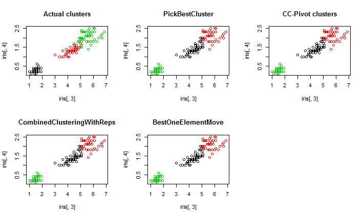

# AggregationMethods
This library contains various consensus and correlation clustering algorithms. The different methods covered in the library so far are: 

1. **CC-Pivot**: This is a randomized algorithm first described in 'Aggregating Inconsistent Information:
   Ranking and Clustering' by Ailon et. al. (https://courses.cs.washington.edu/courses/cse522/05au/aggregation.pdf). *This method also works for correlation clustering.* 
2. **PickBestCluster:** Given a set of clusterings, this picks the clustering that has the lowest total distance from the other clusterings. 
3. **BestOfTwo:** Compares two consensus clusterings by computing their distance from all of the given clusterings and then picks the consensus clustering with the lower total distance. 
4. **CombinedClusteringWithReps:** This is a clustering method that runs the BestOfTwo method for several iterations, keeping the cluster with the lowest total distance. The CC-Pivot algorithm is run at each iteration. 
5. **BestOneElementMove:** This is a clustering method that starts from an initial clustering and keeps making the best possible one element move that reduces the distance from other clusters. This is done till no such moves exist. This is taken from the paper 'Consensus Clustering Algorithms: Comparison and Refinement' by Goder et. al. (http://citeseerx.ist.psu.edu/viewdoc/download?doi=10.1.1.111.3989&rep=rep1&type=pdf). 


### Installation: 

```R
install.packages('devtools') #if devtools isn't already installed
library(devtools)
install_github('mukhes3/AggregationMethods')
```


### Example of different clustering methods:

This code is available through the function 'ConsensusClusteringExample()'. 

```R
  library(datasets)
  head(iris)
  
  InstanceList <- list()
  
  cat('Performing 5 instances of kmeans clustering \n')
  #Running 5 instances of Kmeans clustering 
  for (i in 1:5){ 
    
    temp1 <- kmeans(iris[, 2:4], 3, nstart = 1)
    
    InstanceList <- c(InstanceList, list(temp1$cluster))
    
  }
  
  Temp <- Corr2Cons(InstanceList)
  G <- Temp$G
  N <- length(iris[,3])
  
  par(mfrow=c(2,3))
  
  #Plotting true clusters based on species
  cat('Plotting true clusters based on species \n')
  plot(iris[,3],iris[,4], col = iris$Species)
  title('Actual clusters')
  
  #Performing PickBestCluster clustering
  cat('Performing PickBestCluster clustering \n')
  C_1 <- PickBestCluster(InstanceList)
  C_1 <- as.factor(C_1)
  plot(iris[,3],iris[,4], col = C_1)
  title('PickBestCluster')

  #Performing CC-Pivot clustering
  cat('Performing CC-Pivot clustering \n')
  C_2 <- Convert2Labels(CC.Pivot(G),N)
  C_2 <- as.factor(C_2)
  plot(iris[,3],iris[,4], col = C_2)
  title('CC-Pivot clusters')
  
  #Performing CombinedClusteringWithReps
  cat('Performing CombinedClusteringWithReps, reps = 10 \n')
  C_3 <- CombinedClusteringWithReps(InstanceList, 10)
  C_3 <- as.factor(C_3)
  plot(iris[,3],iris[,4], col = C_3)
  title('CombinedClusteringWithReps')
  
  #Performing BestOneElementMove
  cat('Performing BestOneElementMove \n')
  C_4 <- BestOneElementMove(Temp$Wp, InstanceList, C_1, 100)
  C_4 <- as.factor(C_4)
  plot(iris[,3],iris[,4], col = C_4)
  title('BestOneElementMove')

```

Resulting clustering figures: 

